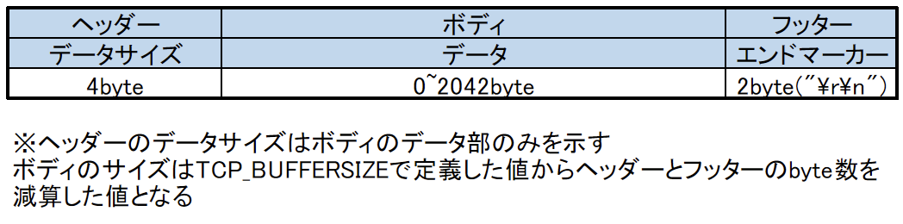

# Orient_server

## ビルド環境
cmake3 version 3.13.1
gcc (GCC) 7.3.1 20180712 (Red Hat 7.3.1-15)


## Amazonlinux2での環境構築
```sh
# sudo yum groupinstall "Development Tools" or $yum install gcc gcc-c++
# yum install cmake3
```

## build(amazon linux 2)
```sh
# cmake3 -S . -B build
# cmake3 --build build
# ./build/Orient_server.out
```

## build(wsl)
```sh
# cmake -S . -B build
# cmake --build build
# ./build/Orient_server.out
```

※windowsマシーン上でテストする際の注意点
wsl2上でserverを実行しclient側をwindowsで動作させるとudpの通信をする際client側で127.0.0.1を指定すると通信が届かない
windowsでnetstatで確認すると解放されていないのがわかる
対策として以下コマンドよりwsl2のipを確認し確認できたipをclientで指定する
```sh
# ip a show dev eth0
```

## cmakeの決まり事
Library以下のディレクトリ名と各種ライブラリ以下のCMakeList.txtのターゲット名は同一にしておく必要がある

## パケット図

